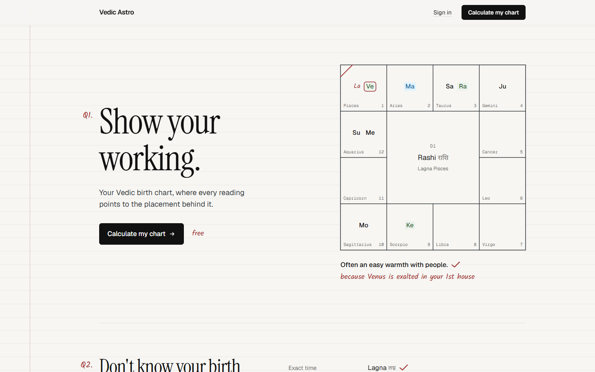
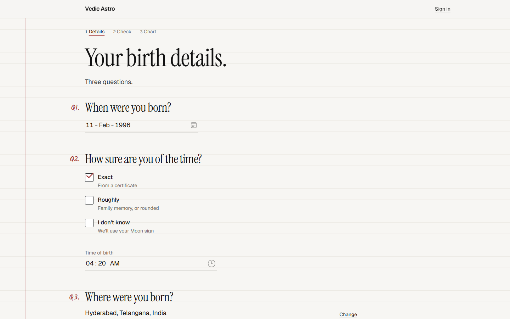
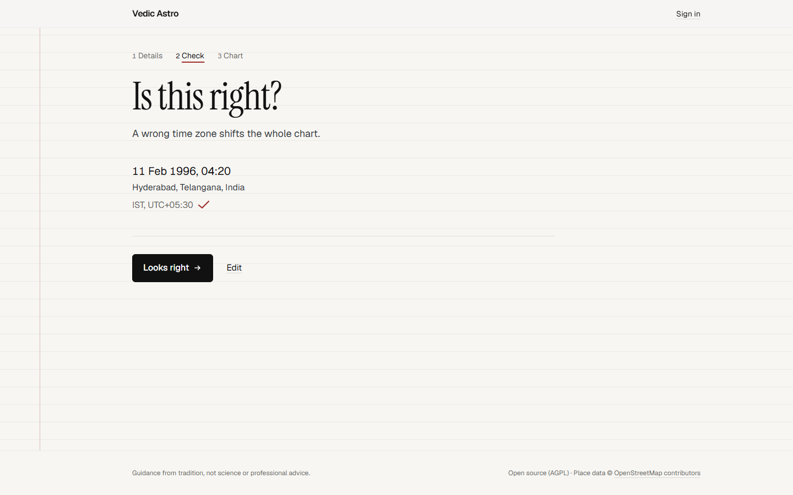
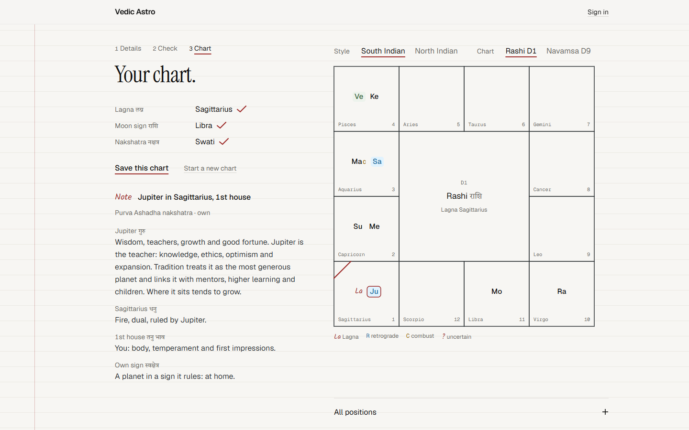
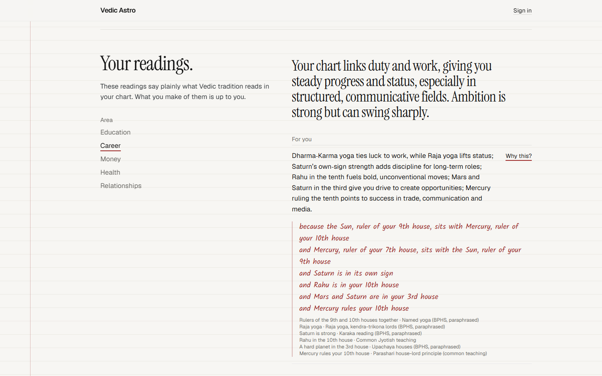
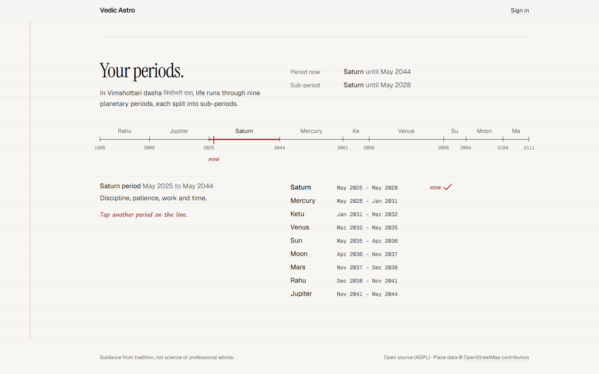
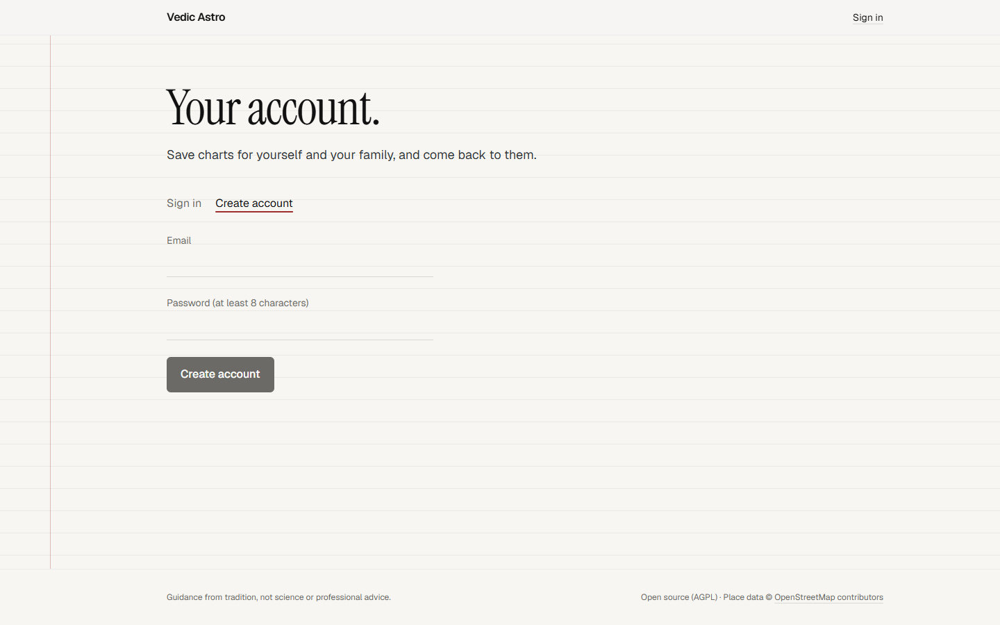

# Vedic Astro

A Vedic (sidereal, Lahiri) astrology web app: birth chart, dasha periods and readings for
education, career, money, health and relationships, each linked to the placement behind it.

## Screenshots

| | |
|---|---|
|  |  |
| **Home.** A sample chart, with a reading and the placement behind it. | **Birth details.** Date, how sure you are of the time, and place. |
|  |  |
| **Check.** The time zone and UTC offset used, before anything is calculated. | **Chart.** South or North Indian, D1 or D9; tap a planet or house to see what it means. |
|  |  |
| **Readings.** Five life areas, written by AI from matched rules; "Why this?" shows the placements. | **Periods.** Vimshottari dasha across your life, with the sub-periods of each. |
|  | |
| **Account.** Email and password; save charts for yourself and family. | |

## Layout

```
apps/api              FastAPI backend: chart engine, rules, AI-written readings
apps/web              Next.js frontend
supabase/migrations   Database tables and security for accounts (Supabase)
data/golden_charts    Reference charts the tests check against
docs/                 Calculation conventions, rule-writing guide, privacy
```

## Requirements

- **Python 3.11+** (3.12 recommended)
- **Node.js 20+** and npm
- Git
- Optional: a free [Supabase](https://supabase.com) project, for accounts and saved charts
- Optional: free API keys from [Google AI Studio](https://aistudio.google.com/apikey)
  and/or [Groq](https://console.groq.com/keys), for AI-written readings

Without the optional parts the app still works: charts, periods and readings all load, and
readings show the rule texts instead of AI-written prose. Sign-in and saving need Supabase.

## 1. Get the code

```bash
git clone https://github.com/varun77t/Astro.git
cd Astro
```

## 2. Configure

### API settings (`.env` in the repo root)

```bash
cp .env.example .env
```

Then fill in what you have:

| Variable | Needed for | Where to get it |
|---|---|---|
| `GEMINI_API_KEY` | AI-written readings | [aistudio.google.com/apikey](https://aistudio.google.com/apikey) |
| `GROQ_API_KEY` | AI-written readings (backup) | [console.groq.com/keys](https://console.groq.com/keys) |
| `SUPABASE_URL` | Signed-in users' higher AI allowance | Supabase → Project Settings → API |
| `GEOCODER_USER_AGENT` | Place search etiquette | Put your own email in it |

Paste each value straight after the `=`, with no quotes or spaces. `.env` is git-ignored;
never commit it.

### Web settings (`apps/web/.env.local`)

```bash
cp apps/web/.env.example apps/web/.env.local
```

| Variable | Value |
|---|---|
| `NEXT_PUBLIC_SUPABASE_URL` | Your Supabase project URL |
| `NEXT_PUBLIC_SUPABASE_PUBLISHABLE_KEY` | Supabase → Project Settings → API keys → publishable key (`sb_publishable_…`) |
| `NEXT_PUBLIC_API_URL` | Only if the API isn't on `http://localhost:8000` |

### Supabase (only for accounts)

1. Create a free project at [supabase.com](https://supabase.com).
2. In the SQL editor, run each file in `supabase/migrations/`, oldest first. This creates the
   `profiles` and `charts` tables with row-level security (each user sees only their own rows).
3. For local testing, turn off **Authentication → Sign In / Providers → Email → Confirm email**,
   so new accounts can sign in straight away. Turn it back on before going public.
4. Copy the project URL and publishable key into the two env files above.

## 3. Run the API

```bash
cd apps/api
python -m venv .venv
.venv/Scripts/activate          # Windows (Git Bash: source .venv/Scripts/activate)
# source .venv/bin/activate     # macOS / Linux
pip install -e ".[dev]"
uvicorn app.main:app --reload --port 8000
```

The API runs at http://localhost:8000 (interactive docs at http://localhost:8000/docs).

## 4. Run the web app

In a second terminal:

```bash
cd apps/web
npm install
npm run dev
```

Open http://localhost:3000 and click **Calculate my chart**.

## Tests

```bash
cd apps/api && pytest                  # engine, rules, dasha, AI layer (no real AI calls)
cd apps/web && npm test                # frontend logic
cd apps/web && npm run lint && npm run build
```

## Useful extras

Print a chart in the terminal, to compare with other software:

```bash
cd apps/api
python -m app.cli 1990-05-17 14:35 Asia/Kolkata 12.9716 77.5946
```

Check AI-written readings against 20 charts with real calls (uses your free quota):

```bash
cd apps/api
python -m app.llm.eval --provider groq --areas career --charts 20
```

## Troubleshooting

- **Readings say "Showing the quick version".** No AI provider answered: no keys in `.env`,
  today's free quota is used up (Gemini's free tier is about 20 requests per model per day),
  or a model was retired. Check the keys, wait for the daily reset, or change the model name
  in `apps/api/app/llm/providers.yaml`.
- **Place search finds nothing.** It needs internet access (OpenStreetMap's Photon and
  Nominatim). Try the nearest town.
- **"Accounts aren't configured".** `apps/web/.env.local` is missing the Supabase values;
  restart `npm run dev` after adding them.
- **Sign-up says to check your email.** Email confirmation is still on in Supabase (see above).
- **The web app can't reach the server.** Make sure the API is running on port 8000, or set
  `NEXT_PUBLIC_API_URL`.

## License

The chart engine uses Swiss Ephemeris, which is dual-licensed (AGPL or a paid professional
license). Running this as a public service under the AGPL means publishing its source under
the AGPL too.
